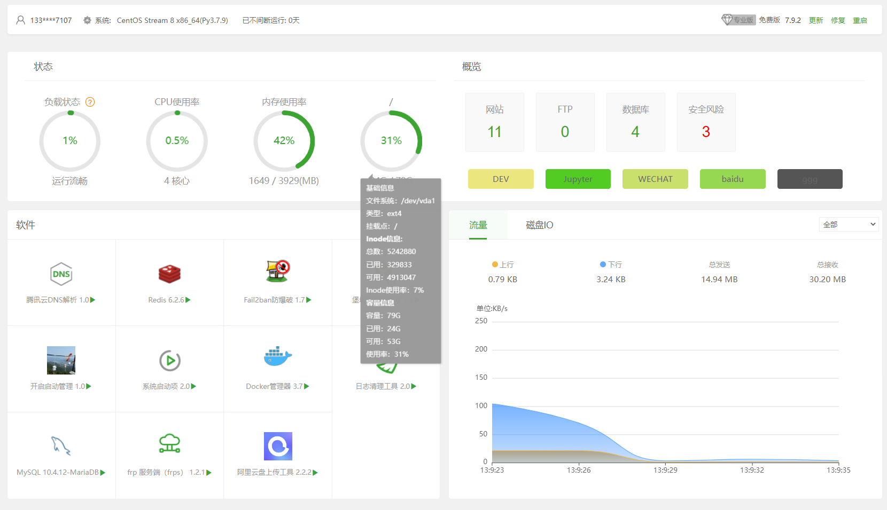
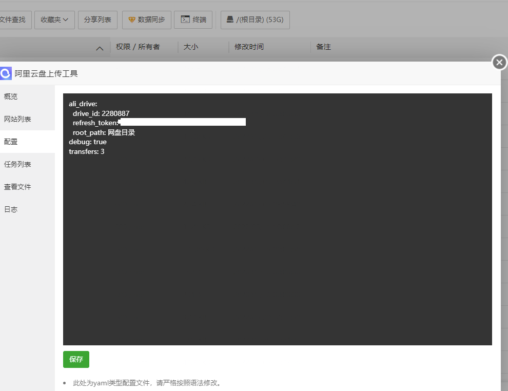

# 宝塔面板补丁

## 实现以下内容：
1. 首页布局优化（见截图）
2. 结合阿里云盘工具，在文件浏览器界面文件一键上传到阿里云盘
3. 去广告、软件列表去掉收费软件
4. 增加站点测试功能，实现首页自动测试站点连通及延时。
5. 删除客服、面板日报等用不到的功能。
6. 任务计划等其他若干改动

## 使用方法：
1. 下载后，运行`python mod_bt.py`文件即可。
2. 阿里云盘需要安装pip install aligo。是面板的py环境。
3. 第一个版本，未经过严密的测试，请谨慎使用。

## 使用截图

